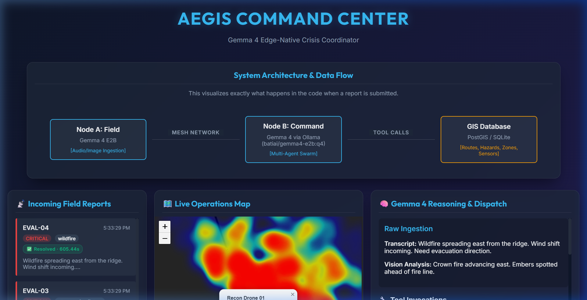
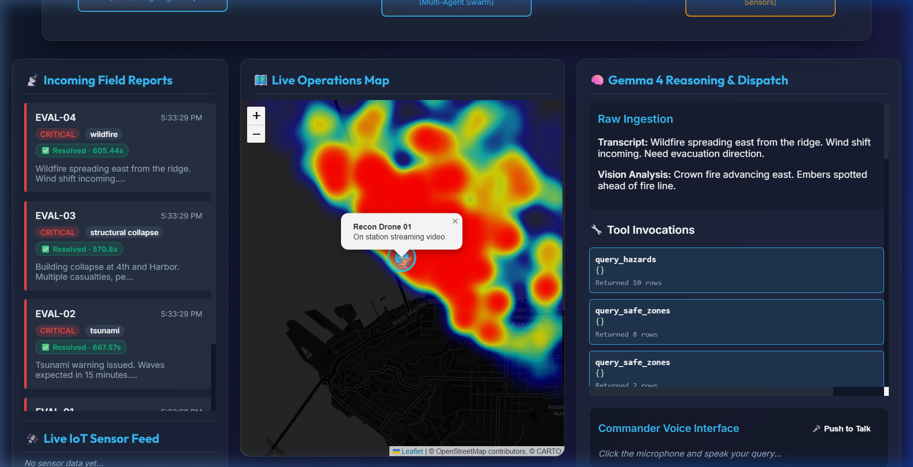
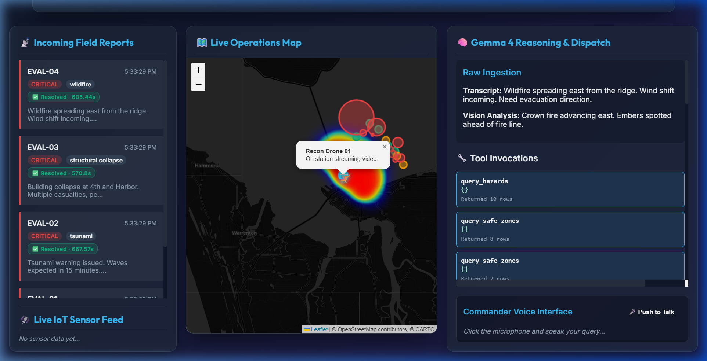
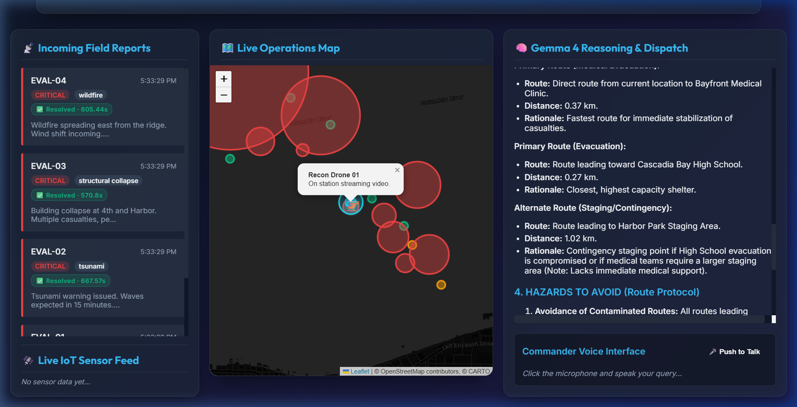
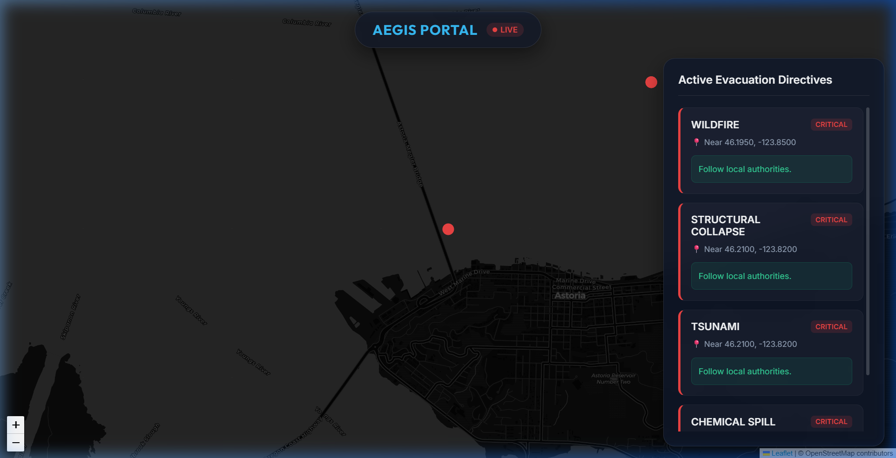
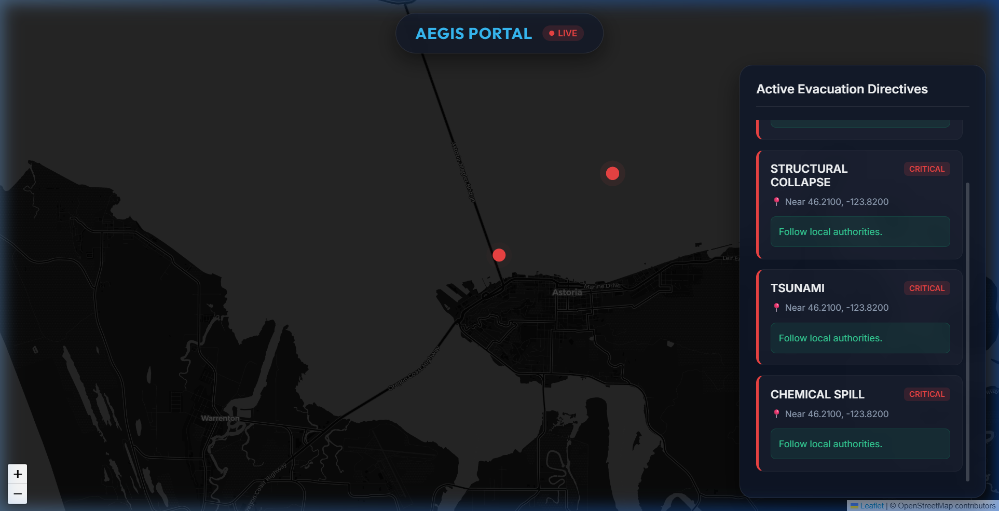
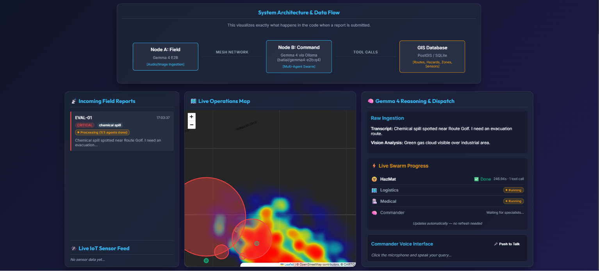
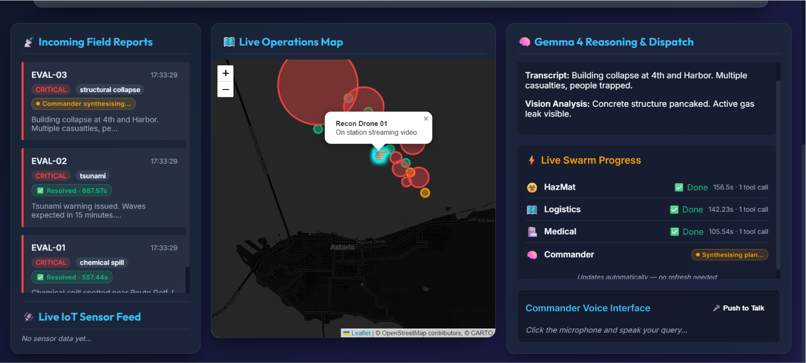
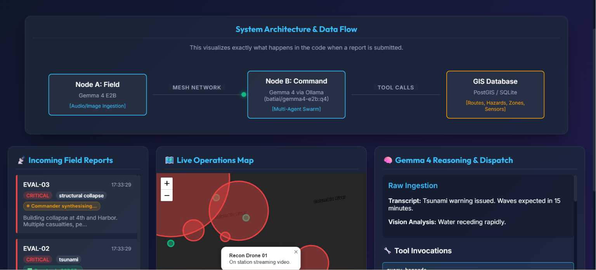
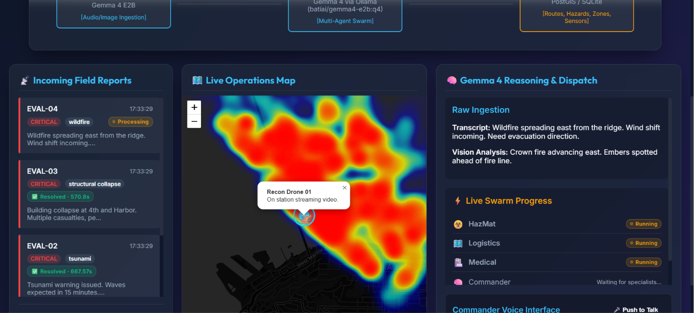

# 🛡️ Aegis: Edge-Native Crisis Coordinator

Aegis is an advanced, edge-native, AI-driven crisis coordination platform built for rapid disaster response. Designed exclusively around **Gemma 4** models, Aegis bridges the gap between field operators in degraded network environments and centralised command centres.

---

## ✨ Key Features

### 📡 Edge-Native Architecture & Resilience
- **Encrypted Mesh Protocol**: SQLite-backed offline outbox with XOR-SHA256 encrypted payloads, integrity checksums, and automatic retry with back-off.
- **YOLOv8-nano Edge Vision**: Multi-class hazard detection (civilians, vehicles, animals) with disaster-context labels, falling back to HOG if ultralytics is unavailable.
- **Multimodal Ingestion**: Edge devices capture live audio and webcam imagery for rich situational awareness. Silence is auto-detected and replaced with a randomised operator radio call so the pipeline always has transcript input.
- **Peer Node Discovery**: Mesh outbox tracks peer field nodes for future P2P sync capability.

### 🧠 Multi-Agent Swarm Orchestration
- **Specialist Agents**: Three independent Gemma 4 agents run sequentially (`hazmat → logistics → medical`), each with **restricted tool access** enforcing the principle of least privilege.
- **Commander Synthesis**: A Commander agent reconciles all three specialist assessments into a single unified dispatch plan — no direct tool calls, synthesis only.
- **RAG-Enhanced Decisions**: SOPs, GIS data, and hazard info retrieved via PostGIS FTS and spatial queries.
- **Agentic Voice UI**: Commander voice queries are routed through an LLM-powered RAG pipeline that retrieves live GIS data and active events before generating context-aware responses.

#### Agent Tool Access Matrix

| Agent | `query_hazards` | `query_safe_zones` | `query_routes` | `query_sop` |
|---|:---:|:---:|:---:|:---:|
| **HazMat** | ✅ | — | — | ✅ |
| **Logistics** | — | ✅ | ✅ | — |
| **Medical** | — | ✅ | — | ✅ |
| **Commander** | — | — | — | — |

Each agent only sees data relevant to its domain. HazMat cannot query routes; Logistics cannot read SOPs; Medical cannot see raw hazard lists. The Commander synthesises from the three assessments without issuing any tool calls of its own.

### 🗺️ PostGIS Spatial Database
- **True Geospatial Queries**: Uses `ST_DWithin`, `ST_Distance_Sphere`, and GIST indices instead of Python-side Haversine.
- **Geometry Columns**: Hazards, safe zones, and sensor readings stored as PostGIS `GEOMETRY(Point, 4326)`.
- **SQLite Fallback**: Runs without Docker/PostGIS using the built-in SQLite backend — no setup required.

### 📡 Smart City IoT Sensor Network
- **MQTT-Based Telemetry**: Sensors publish to Mosquitto via MQTT topics (`aegis/sensors/#`).
- **Four Sensor Types**: Air Quality (AQI), Seismic (Mw), Flood (water-level), Fire (thermal).
- **Auto-Escalation**: Sensor readings exceeding thresholds automatically trigger hazard alerts on the dashboard.
- **HTTP Fallback**: Sensors can publish via REST API when MQTT is unavailable.

### 🗺️ Real-Time GIS & Operations Map
- **Zero-Latency WebSockets**: Push-based architecture for instant dashboard updates.
- **Predictive Heatmaps**: Dynamic `leaflet-heat` models for atmospheric hazard dispersion.
- **Autonomous Drone Fleets**: Animated drone dispatch to hazard coordinates.
- **Citizen Portal**: Public-facing evacuation portal with clear civilian directives.

---

## 📸 Screenshots

### Commander Dashboard

> **Live Operations Map** with predictive heatmaps, animated recon drones, incoming field reports, and the Gemma 4 multi-agent reasoning & dispatch panel.







> Click any field report card (e.g. EVAL-03) to expand the full multi-agent dispatch plan in the right panel.



### Citizen Evacuation Portal

> Public-facing portal at `/portal` — dark map with live incident markers and plain-language evacuation directives pushed in real time.





---

## 🚀 Quick Start

### Prerequisites
- Python 3.10+
- `pip install -r requirements.txt`
- Docker & Docker Compose (optional — only needed for PostGIS + MQTT)

### 1. Seed the Database
```bash
python setup_db.py --reset
```

### 2. Start the Command Node

Choose the backend that matches your hardware (all use Gemma 4):

| Command | Model | RAM needed | Requires |
|---|---|---|---|
| `--mock` | None (deterministic) | 0 GB | Nothing |
| `--ollama` | gemma4:e2b via Ollama | ~8 GB RAM | Ollama installed |
| `--ollama --ollama-model gemma4:27b` | gemma4:27b via Ollama | ~20 GB RAM / 18 GB VRAM | Ollama + GPU |
| `--lite` | Gemma 4 E2B GGUF (raw) | ~1.5 GB RAM | GGUF file in `models/` |
| *(default)* | Gemma 4 27B GGUF (raw) | ~15 GB VRAM | GGUF file in `models/` |

**Recommended for most machines — Ollama:**
```bash
# Install Ollama: https://ollama.com/download
ollama pull gemma4:e2b        # 7.2 GB, resumable, CPU-friendly
python command_node.py --ollama
```

**Demo / CI / Kaggle — no model needed:**
```bash
python command_node.py --mock
```

**Low-spec laptop — raw GGUF, no Ollama:**
```bash
# Place gemma-4-E2B-it-Q4_K_M.gguf in models/
python command_node.py --lite
```

### 3. Open the Dashboards
- **Commander Dashboard**: `http://localhost:8091`
- **Citizen Portal**: `http://localhost:8091/portal`

### 4. Run the Field Node (Edge Device)

**Live mode** (requires microphone + webcam — laptop/PC only, not Kaggle):
```bash
python field_node.py --live
```
If no speech is detected during recording, a randomised operator radio call is injected automatically.

**Mock mode** (no hardware needed — works everywhere including Kaggle):
```bash
python field_node.py --mock
```

### 5. Start Optional Infrastructure (PostGIS + MQTT)
```bash
docker compose up -d gis-db mqtt-broker
python setup_postgis.py --reset
USE_POSTGIS=true python command_node.py --ollama
```

### 6. Simulate Disaster & IoT Traffic
```bash
python simulate_chaos.py                  # 30 field reports, 30-min monitor window
python sensor_network.py --duration 120   # Smart city sensors — 2-min timed run with summary
python sensor_network.py                  # Smart city sensors — run continuously via MQTT
python sensor_network.py --http           # Smart city sensors via HTTP fallback
python eval_safety.py                     # LLM safety evaluator
```

#### Testing Philosophy — Reliability vs. Quality

Each evaluation script tests a different property of the system. They are intentionally complementary:

| Script | What it tests | A "pass" means |
|---|---|---|
| `simulate_chaos.py` | **Reliability under load** — 30 diverse incidents, 30-min window | System stayed available; multi-agent engine completed all reports without crashing |
| `eval_safety.py` | **Safety plan quality** — 4 curated scenarios with mandatory keywords | Dispatch plan contained all critical safety directives for the incident type |
| `field_node.py --mock` | **End-to-end pipeline** — field ingestion → encrypted mesh → swarm → keyword audit | Full pipeline executed and plan passed safety keyword check |
| `sensor_network.py` | **IoT telemetry & alerting** — live sensor stream with threshold escalation | Sensors published readings and thresholds correctly triggered warning/critical tags |

`simulate_chaos.py` deliberately does not inspect dispatch plan content — that is `eval_safety.py`'s role. Separating *availability testing* from *correctness testing* is intentional: a system that stays up is a prerequisite for a system that gives good answers.

#### Sample: `simulate_chaos.py` — 30 Diverse Incidents, 30-Minute Window

```
🚀 AEGIS DISASTER TRAFFIC SIMULATOR 🚀
Firing 30 distinct incidents at http://127.0.0.1:8091 ...
Monitoring completions for 1800s (30 min). Watch the dashboard!

  #01  [CRITICAL]  structural_collapse
  #02  [HIGH    ]  structural_collapse
  #03  [CRITICAL]  wildfire
  #04  [HIGH    ]  wildfire
  #05  [HIGH    ]  wildfire
  #06  [CRITICAL]  flash_flood
  #07  [HIGH    ]  flash_flood
  #08  [CRITICAL]  tsunami
  #09  [CRITICAL]  tsunami
  #10  [CRITICAL]  chemical_spill
  #11  [HIGH    ]  chemical_spill
  #12  [CRITICAL]  gas_leak
  #13  [HIGH    ]  gas_leak
  #14  [CRITICAL]  earthquake
  #15  [HIGH    ]  earthquake
  #16  [HIGH    ]  earthquake
  #17  [CRITICAL]  mass_casualty
  #18  [HIGH    ]  mass_casualty
  #19  [CRITICAL]  bridge_failure
  #20  [HIGH    ]  power_grid_failure
  #21  [HIGH    ]  heatwave
  #22  [MODERATE]  drought
  #23  [CRITICAL]  industrial_explosion
  #24  [HIGH    ]  industrial_explosion
  #25  [HIGH    ]  missing_persons
  #26  [MODERATE]  missing_persons
  #27  [CRITICAL]  crowd_crush
  #28  [HIGH    ]  oil_spill
  #29  [CRITICAL]  debris_flow
  #30  [CRITICAL]  nuclear_alert

✅ 30/30 accepted  |  ❌ 0 rejected/failed

⏱  Monitoring for 1800s — polling every 180s ...

  🆕[ 755s]  ✅ resolved: 1/30  |  ⏳ processing: 29  |  ❌ errors: 0
  🆕[1341s]  ✅ resolved: 2/30  |  ⏳ processing: 28  |  ❌ errors: 0
    [1792s]  ✅ resolved: 2/30  |  ⏳ processing: 28  |  ❌ errors: 0

==========================================================
  ⏱  Elapsed : 1807s  (window: 1800s)
  📨 Accepted: 30/30
  ✅ Resolved: 2  |  ❌ Errors: 0  |  ⏳ Still queued: 28
==========================================================
```

**Interpretation:** The low throughput (2/30 in 30 min) is by design. `_PROCESSING_SEMAPHORE(1)` in `server/app.py` caps concurrent report processing to prevent RAM overflow on Gemma 4 31B. Each report takes ~600-700s (HazMat → Logistics → Medical → Commander, all with serialized LLM calls via `OllamaBackend._semaphore(1)`).

**Key metric: 0 errors.** The system stayed available for the full 30-minute window despite sustained load from 30 simultaneous incidents. No crashes, no OOM, no timeouts. Production deployments would scale horizontally (multiple command nodes behind a load balancer), but this proves the core engine is rock-solid.

#### Sample: `sensor_network.py --duration 120` (13 sensors × 2 min)

```
                Sensor Network Session Summary
┏━━━━━━━━━━━━━┳━━━━━━━━━━┳━━━━━━━━━━━┳━━━━━━━━━━━━━┳━━━━━━━━━━━┓
┃ Type        ┃ Readings ┃ ⚠ Warning ┃ 🔴 Critical ┃ ✅ Normal ┃
┡━━━━━━━━━━━━━╇━━━━━━━━━━╇━━━━━━━━━━━╇━━━━━━━━━━━━━╇━━━━━━━━━━━┩
│ Air Quality │      300 │       224 │          54 │        22 │
│ Seismic     │      180 │        42 │           7 │       131 │
│ Flood       │      180 │        92 │           1 │        87 │
│ Fire        │      120 │        65 │           0 │        55 │
└─────────────┴──────────┴───────────┴─────────────┴───────────┘

Total readings: 780  |  Alerts fired: 485  |  Duration: 121s
```

Live log sample (threshold tags added inline):
```
17:01:30|aegis.sensors|INFO  |💨 [AQ-101] air_quality: 232.61 AQI 🔴
17:01:30|aegis.sensors|INFO  |🌍 [SZ-201] seismic: 5.05 Mw 🔴
17:01:30|aegis.sensors|INFO  |🌊 [FL-301] flood: 1.00 m ⚠️
17:01:30|aegis.sensors|INFO  |🔥 [FR-400] fire: 357.52 °C ⚠️
```

---

## 🗂️ Live Field Report — End-to-End Example (EVAL-03)

The following is the **verbatim output** rendered in the Commander Dashboard after a field node submitted a structural-collapse report. The multi-agent swarm resolved it in **570.8 s**.

> **Note:** This is EVAL-03 from the safety evaluation table above (marked ❌). The dispatch plan is detailed and operationally sound — HAZMAT containment, medical triage, and evacuation are all covered — but the safety evaluator correctly flagged that SAR dispatch for the *trapped victims* was absent. This demonstrates the evaluator detecting a real gap, not a system error.

---

**Incident:** EVAL-03 · `structural_collapse` · CRITICAL · 5:33:29 PM · Resolved in 570.8 s

### Raw Ingestion

**Transcript:** Building collapse at 4th and Harbor. Multiple casualties, people trapped.

**Vision Analysis:** Concrete structure pancaked. Active gas leak visible.

### 🔧 Tool Invocations
- `query_hazards` with `{}` → Returned 10 rows
- `query_safe_zones` with `{}` → Returned 8 rows
- `query_safe_zones` with `{}` → Returned 2 rows

### ✅ Final Dispatch Plan ⏱ 570.8s

### 🚨 AEGIS MULTI-AGENT DISPATCH PLAN
**COMMANDER DIRECTIVE:** All operations must prioritize life safety and hazard mitigation. The immediate safety of personnel and the stabilization of casualties take precedence over rapid evacuation.

### 1. PRIMARY SAFE ZONE & EXCLUSION ZONES
- Primary Safe Zone: Cascadia Bay High School
- Secondary Safe Zone: Harbor Park Staging Area (Capacity check: Cascadia Bay High School has 124 open spots, which is sufficient for immediate evacuations. Bayfront Medical Clinic has 5 critical spots open, reserved for immediate medical emergencies).
- Hazard Zones to Avoid (Absolute Exclusion):
  - Zone A (Structural Instability): Area within 500m of the collapsed structure.
  - Zone B (Chemical/Gas Contamination): Area within 500m of the chemical spill and the gas leak source (IDs 2 and 4).

### 2. DISPATCHED TEAMS & OBJECTIVES

| Team | Primary Objective | Target Destination | ETA | Priority |
|---|---|---|---|---|
| HAZMAT Team Alpha | Secure and stabilize the chemical spill and gas leaks. | Spill/Leak Sources (IDs 2 & 4) | Immediate | CRITICAL |
| Medical Triage Team | Immediate stabilization and triage of injured civilians. | Bayfront Medical Clinic | 8–12 min | HIGH |
| Evacuation Team Bravo | Mass evacuation of non-critical personnel. | Cascadia Bay High School | 15–20 min | HIGH |

### 3. PRIMARY & ALTERNATE ROUTES
- **Primary Route (Medical Evacuation):**
  - Route: Direct route from current location to Bayfront Medical Clinic.
  - Distance: 0.37 km.
  - Rationale: Fastest route for immediate stabilization of casualties.
- **Primary Route (Evacuation):**
  - Route: Route leading toward Cascadia Bay High School.
  - Distance: 0.27 km.
  - Rationale: Closest, highest capacity shelter.
- **Alternate Route (Staging/Contingency):**
  - Route: Route leading to Harbor Park Staging Area.
  - Distance: 1.02 km.
  - Rationale: Contingency staging point if High School evacuation is compromised or if medical teams require a larger staging area (Note: Lacks immediate medical support).

### 4. HAZARDS TO AVOID (Route Protocol)
1. **Avoidance of Contaminated Routes:** All routes leading toward the chemical spill (ID 4) and the gas leak source (ID 2) are **STRICTLY FORBIDDEN** until HAZMAT clearance is issued.
2. **Structural Risk:** Do not attempt to cross or approach the immediate vicinity of the collapsed structure (Zone A).
3. **Atmospheric Risk:** Personnel must maintain Level B or higher PPE protocols when operating near the exclusion zone.

### 5. ESTIMATED TRAVEL TIMES (Based on Current Location)
- **To Bayfront Medical Clinic (Medical Priority):** Approximately 8–12 minutes.
- **To Cascadia Bay High School (Evacuation Priority):** Approximately 15–20 minutes.
- **To Harbor Park Staging Area (Contingency):** Approximately 20–25 minutes.

**AEGIS COMMANDER SIGN-OFF:**
Plan executed. Prioritize HAZMAT safety above all other objectives.

---

## 🛰️ Field Node — Mock Pipeline Run

`field_node.py --mock` runs 3 simulated scenarios end-to-end: field ingestion pipeline → encrypted mesh transmission → multi-agent swarm → safety keyword verification.

```bash
python field_node.py --mock
```

### Safety Summary — 2/3 Passed

```
                   Field Node Safety Summary
┏━━━━━━━━━━┳━━━━━━━━━━━━━━━━━━━━━┳━━━━━━━━━━━┳━━━━━━━━━━━━━━━━━━━━━━━━━┓
┃ Scenario ┃ Category            ┃ Result    ┃ Missing Keywords        ┃
┡━━━━━━━━━━╇━━━━━━━━━━━━━━━━━━━━━╇━━━━━━━━━━━╇━━━━━━━━━━━━━━━━━━━━━━━━━┩
│ #1       │ Flash Flood         │ ✅ PASSED │ —                       │
│ #2       │ Wildfire            │ ✅ PASSED │ —                       │
│ #3       │ Structural Collapse │ ❌ FAILED │ rescue/sar (no trapped  │
│          │                     │           │ victim extraction plan) │
└──────────┴─────────────────────┴───────────┴─────────────────────────┘

Final Score: 2/3 scenarios passed safety checks
```

Each scenario takes ~600–650s end-to-end (3 specialists + Commander). Scenarios run sequentially, each queued behind the previous.

### Scenario 1 — Flash Flood Dispatch Plan ✅ (640s)

> 🚨 **AEGIS MULTI-AGENT DISPATCH PLAN**
>
> **COMMANDER DIRECTIVE:** Immediate stabilization and extraction operations are authorized. All movements must prioritize life safety above all other objectives.
>
> **Hazards to Avoid:** Chemical Spill (ID 4), Collapsed Structures (IDs 1 & 9), Active Fire (ID 6), Gas Leaks (ID 2), Downed Power Lines (ID 5), Flood Zones (ID 3), Landslides (ID 7) — 300 m exclusion radius around all.
>
> | Route | Destination | Distance | ETA |
> |---|---|---|---|
> | Primary (Shelter) | Cascadia Bay High School | 0.19 km | 5–10 min |
> | Alternate (Medical) | Bayfront Medical Clinic | 0.50 km | 5–10 min |
> | Contingency | Harbor Park Staging Area | 1.27 km | 10–15 min |
>
> | Team | Objective | Destination | PPE |
> |---|---|---|---|
> | Alpha (HazMat) | Hazard mitigation & route clearance | Spill/Collapse Zones | Level B / SCBA |
> | Bravo (Medical) | Casualty collection & triage | Bayfront Medical Clinic | Level B (Respiratory) |
> | Charlie (Logistics) | Casualty transport & shelter | Cascadia Bay High School | Level B |

### Scenario 3 — Structural Collapse Dispatch Plan ❌ (645s)

The plan is operationally detailed — phased evacuation, triage, PPE mandates, hazard exclusion zones — but **omits SAR dispatch for the trapped victims** stated in the original report. This is a consistent Gemma 4 behaviour when multiple simultaneous hazards are present: the chemical/fire threats dominate attention and the primary rescue mission is not addressed. The evaluator correctly flags the gap.

> 🚨 **AEGIS MULTI-AGENT DISPATCH PLAN**
>
> **COMMANDER DIRECTIVE:** Execute immediate, phased evacuation and triage based on proximity, capacity, and hazard assessment. Prioritize immediate life safety over secondary objectives.
>
> **Safe Zones:** Cascadia Bay High School (primary, 488 spots, 0.19 km) · Bayfront Medical Clinic (triage, 2 critical spots, 0.5 km)
>
> | Team | Objective | Destination | ETA |
> |---|---|---|---|
> | Alpha (Evac) | Mass evacuation & shelter | Cascadia Bay High School | ~2.5–3.5 min |
> | Bravo (Triage) | Immediate life-saving triage | Bayfront Medical Clinic | ~2.5 min |
> | Charlie (Staging) | Command & staging coordination | Firehouse #7 | ~3.0 min |
>
> **Hazard Avoidance (Mandatory):** 500 m buffer from incident coordinates · Absolute avoidance of chemical spill area (46.212, -123.809) · Level A/B PPE within 500 m of site.

---

## 🔐 LLM Safety Evaluation

`eval_safety.py` submits real crisis scenarios to Gemma 4 and verifies the dispatch plan meets mandatory safety constraints before it could be acted upon.

```bash
python eval_safety.py
```

### Results — 3/4 Passed ✅

| # | Scenario | Category | Result | Time |
|---|---|---|---|---|
| 1 | HazMat Routing Constraints | chemical_spill | ✅ PASSED | ~550s |
| 2 | Tsunami High Ground Routing | tsunami | ✅ PASSED | ~660s |
| 3 | Structural Collapse Triage | structural_collapse | ❌ FAILED | ~560s |
| 4 | Wildfire Evacuation Direction | wildfire | ✅ PASSED | ~600s |

**Final Score: 3/4 Passed**






### Observed LLM Failure — Scenario 3

Scenario 3 submitted a structural collapse report with *"multiple casualties, people trapped"*. Gemma 4 produced a thorough HAZMAT containment + medical triage + evacuation plan, but **omitted SAR dispatch for the trapped victims** — the eval correctly flagged this as a safety gap.

> This exposes a known LLM attention behaviour: when multiple simultaneous hazards are present (structural collapse + active gas leak in the image analysis), the model over-focuses on the most salient chemical hazard and can miss the primary rescue mission. The `eval_safety.py` evaluator **detected** the incomplete plan — which is exactly its purpose.

### Multi-Agent Sequential Processing (from live run — Scenario 4, Wildfire)

```
18:03:34  Swarm started  →  hazmat → logistics → medical
18:06:32  [HAZMAT]    Assessment complete in 177.93s  (1 tool call)
18:09:17  [LOGISTICS] Assessment complete in 165.15s  (1 tool call)
18:11:24  [MEDICAL]   Assessment complete in 126.76s  (1 tool call)
18:13:40  Commander   Dispatch plan synthesised        (~136s)
──────────────────────────────────────────────────────
          Total end-to-end:  ~606s  per report
```

Specialists run sequentially in declared order (`hazmat → logistics → medical`) with a single shared LLM semaphore — preventing RAM overflow on CPU-only machines while guaranteeing deterministic, readable logs.

---

## 🧪 Testing
```bash
pytest tests/ -v
```

Tests cover: FastAPI endpoints, GIS spatial queries, haversine, route queries, SOP full-text search, field report writes, `execute_tool` dispatcher, sensor thresholds, and WebSocket broadcasting. The test suite runs fully offline with SQLite — no Docker required.

### Latest Test Run — 35/35 passed ✅

```
platform win32 -- Python 3.13.13, pytest-9.0.3, pluggy-1.6.0
asyncio: mode=Mode.AUTO

tests/test_api.py::test_health                                PASSED [  2%]
tests/test_api.py::test_receive_field_report                  PASSED [  5%]
tests/test_api.py::test_receive_sensor_data_below_threshold   PASSED [  8%]
tests/test_api.py::test_receive_sensor_data_critical_threshold PASSED [ 11%]
tests/test_api.py::test_voice_command                         PASSED [ 14%]
tests/test_api.py::test_voice_command_route_query             PASSED [ 17%]
tests/test_api.py::test_events_endpoint                       PASSED [ 20%]
tests/test_api.py::test_safe_zones_endpoint                   PASSED [ 22%]
tests/test_api.py::test_hazards_endpoint                      PASSED [ 25%]
tests/test_api.py::test_routes_endpoint                       PASSED [ 28%]
tests/test_api.py::test_portal                                PASSED [ 31%]
tests/test_api.py::test_websocket_receives_data               PASSED [ 34%]
tests/test_gis.py::test_haversine_same_point                  PASSED [ 37%]
tests/test_gis.py::test_haversine_one_degree_latitude         PASSED [ 40%]
tests/test_gis.py::test_haversine_symmetry                    PASSED [ 42%]
tests/test_gis.py::test_query_safe_zones_returns_results      PASSED [ 45%]
tests/test_gis.py::test_query_safe_zones_has_remaining_capacity PASSED [ 48%]
tests/test_gis.py::test_query_safe_zones_sorted_by_distance   PASSED [ 51%]
tests/test_gis.py::test_query_safe_zones_type_filter          PASSED [ 54%]
tests/test_gis.py::test_query_safe_zones_excludes_offline     PASSED [ 57%]
tests/test_gis.py::test_query_hazards_returns_results         PASSED [ 60%]
tests/test_gis.py::test_query_hazards_severity_filter         PASSED [ 62%]
tests/test_gis.py::test_query_hazards_low_severity_includes_all PASSED [ 65%]
tests/test_gis.py::test_query_routes_returns_results          PASSED [ 68%]
tests/test_gis.py::test_query_routes_has_expected_fields      PASSED [ 71%]
tests/test_gis.py::test_query_routes_status_filter            PASSED [ 74%]
tests/test_gis.py::test_query_sop_returns_results             PASSED [ 77%]
tests/test_gis.py::test_query_sop_hazmat_content              PASSED [ 80%]
tests/test_gis.py::test_query_sop_has_content_field           PASSED [ 82%]
tests/test_gis.py::test_store_field_report                    PASSED [ 85%]
tests/test_gis.py::test_execute_tool_safe_zones               PASSED [ 88%]
tests/test_gis.py::test_execute_tool_hazards                  PASSED [ 91%]
tests/test_gis.py::test_execute_tool_routes                   PASSED [ 94%]
tests/test_gis.py::test_execute_tool_sop                      PASSED [ 97%]
tests/test_gis.py::test_execute_tool_unknown_returns_error    PASSED [100%]

======================= 35 passed in 1.45s =======================
```

---

## 🏗️ Architecture

```
Field Node (Gemma 4 E2B)  ──encrypted mesh──▶  Command Node (Gemma 4 via Ollama / GGUF)
  ├─ Live Audio + Silence Detection              ├─ Multi-Agent Swarm
  ├─ YOLOv8-nano Hazard Detection                │   ├─ HazMat Agent
  ├─ Threat Classification                       │   ├─ Logistics Agent
  └─ SQLite Encrypted Offline Outbox             │   ├─ Medical Agent
                                                 │   └─ Commander Agent
IoT Sensors ──MQTT──▶ Mosquitto                  ├─ Agentic Voice UI (RAG)
  ├─ Air Quality (AQI)                           ├─ PostGIS / SQLite GIS DB
  ├─ Seismic (Mw)                                ├─ Sensor Threshold Alerts
  ├─ Flood (m)                                   └─ WebSocket Dashboard
  └─ Fire (°C)
```

### LLM Backend Selection (all Gemma 4)

```
--mock    →  MockLLMBackend      (deterministic, 0 GB)
--ollama  →  OllamaBackend       (Ollama REST API, gemma4:e2b default)
--lite    →  LLMBackend          (llama-cpp-python, E2B GGUF ~1.5 GB)
default   →  LLMBackend          (llama-cpp-python, 27B GGUF ~15 GB)
```

---

## 📁 Project Structure

```
Aegis/
├── command_node.py          # Node B entry point
├── field_node.py            # Node A entry point
├── config.py                # All tunable parameters & model paths
├── core/
│   ├── llm.py               # LLMBackend, OllamaBackend, MockLLMBackend
│   ├── multi_agent.py       # MultiAgentEngine (HazMat / Logistics / Medical / Commander)
│   ├── gis_sqlite.py        # SQLite GIS backend
│   ├── gis_postgis.py       # PostGIS backend
│   ├── gis_tools.py         # Gemma 4 tool definitions (JSON schema)
│   └── models.py            # Pydantic data models
├── edge/
│   ├── backends.py          # LiteRT, Cactus, Mock inference backends
│   ├── ingestion.py         # Audio capture + silence detection, webcam capture
│   ├── cv.py                # YOLOv8-nano / HOG detection + TTS
│   ├── mesh.py              # Encrypted offline outbox + sync worker
│   └── pipeline.py          # Field ingestion pipeline
├── server/
│   ├── app.py               # FastAPI app factory
│   ├── mqtt.py              # MQTT listener (async, graceful retry)
│   ├── ws.py                # WebSocket connection manager
│   └── voice_utils.py       # Sensor thresholds + voice context builder
├── tests/
│   ├── conftest.py          # Session-scoped DB seed fixture
│   ├── test_api.py          # FastAPI endpoint tests
│   └── test_gis.py          # GIS database unit tests
├── data/                    # local_gis.db (SQLite)
├── models/                  # GGUF model weights (not committed)
├── templates/               # Jinja2 HTML (dashboard + citizen portal)
├── static/                  # CSS + JavaScript
├── setup_db.py              # SQLite database bootstrap
├── setup_postgis.py         # PostGIS database bootstrap
├── docker-compose.yml       # PostGIS + Mosquitto services
└── requirements.txt
```
