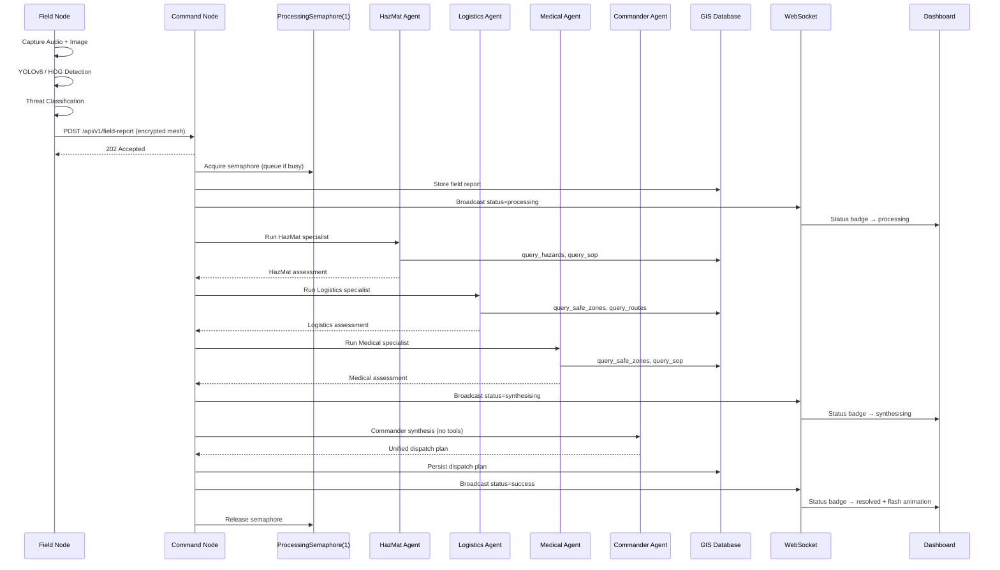

# 🛡️ Aegis — Codebase Architecture

> A complete guide to every file in the Aegis project, how they connect, and what each one does.

---

## System Overview

```
┌──────────────────────────────────────────────────────────────────────┐
│                      FIELD NODE  (Node A)                            │
│  field_node.py  /  edge/                                             │
│  ├─ Audio capture → Gemma 4 E2B transcription                        │
│  ├─ Webcam capture → YOLOv8-nano / HOG detection  (edge/cv.py)       │
│  ├─ Threat classification  (edge/ingestion.py)                       │
│  ├─ Inference backends: LiteRT / Cactus / Mock  (edge/backends.py)   │
│  ├─ Encrypted mesh outbox: SQLite + XOR-SHA256  (edge/mesh.py)       │
│  └─ Mock pipeline: poll dispatch plan + safety check after each run  │
└───────────────────────────┬──────────────────────────────────────────┘
                            │  HTTP POST (simulated mesh)
                            ▼
┌──────────────────────────────────────────────────────────────────────┐
│                    COMMAND NODE  (Node B)                            │
│  command_node.py  →  server/app.py                                   │
│  ├─ FastAPI server (:8091)                                           │
│  ├─ _PROCESSING_SEMAPHORE(1) — one report processed at a time        │
│  ├─ Multi-Agent Swarm  (core/multi_agent.py)                         │
│  │    Sequential: HazMat → Logistics → Medical → Commander           │
│  │    OllamaBackend._semaphore(1) — serialised LLM calls             │
│  ├─ RAG: GIS + hazard queries via core/gis_tools.py                  │
│  ├─ Agentic Voice UI  (server/voice_utils.py)                        │
│  ├─ MQTT subscriber → WebSocket broadcaster  (server/mqtt.py)        │
│  ├─ WebSocket hub  (server/ws.py)                                    │
│  └─ Serves dashboard + citizen portal                                │
└───────┬──────────────┬──────────────┬────────────────────────────────┘
        │              │              │
        ▼              ▼              ▼
   ┌─────────┐   ┌──────────┐   ┌──────────────┐
   │ PostGIS │   │ SQLite   │   │  Mosquitto   │
   │  DB     │   │ Fallback │   │  MQTT Broker │
   └─────────┘   └──────────┘   └──────┬───────┘
                                       ▲
                                       │  MQTT Publish
                              ┌────────┴────────┐
                              │ sensor_network.py│
                              │ (IoT Simulator) │
                              └─────────────────┘
```

---

## Multi-Agent Swarm Detail

Agents run **sequentially** (not in parallel) to conserve RAM and ensure deterministic log ordering. Each specialist only has access to tools relevant to its domain — principle of least privilege.

```
Field Report
     │
     ▼
┌──────────────────────────────────────────────────┐
│  HazMat Specialist                               │
│  Tools: query_hazards, query_sop                 │
│  → Hazard identification, PPE, exclusion zones   │
└───────────────────────────┬──────────────────────┘
                            │  Assessment text
                            ▼
┌──────────────────────────────────────────────────┐
│  Logistics Specialist                            │
│  Tools: query_safe_zones, query_routes           │
│  → Evacuation routes, shelter capacity, ETAs     │
└───────────────────────────┬──────────────────────┘
                            │  Assessment text
                            ▼
┌──────────────────────────────────────────────────┐
│  Medical Specialist                              │
│  Tools: query_safe_zones, query_sop              │
│  → Triage priorities, hospital routing, SOPs     │
└───────────────────────────┬──────────────────────┘
                            │  Assessment text
                            ▼
┌──────────────────────────────────────────────────┐
│  Commander Agent  (no tool calls — synthesis only)│
│  → Reconciles all three → Unified dispatch plan  │
└──────────────────────────────────────────────────┘
```

### Agent Tool Access Matrix

| Agent | `query_hazards` | `query_safe_zones` | `query_routes` | `query_sop` |
|---|:---:|:---:|:---:|:---:|
| **HazMat** | ✅ | — | — | ✅ |
| **Logistics** | — | ✅ | ✅ | — |
| **Medical** | — | ✅ | — | ✅ |
| **Commander** | — | — | — | — |

---

## Python Files

### Entry Points

| File | Lines | Purpose |
|------|-------|---------|
| [command_node.py](file:///c:/Users/harsh/Gemma4/command_node.py) | ~30 | **Thin launcher.** Imports the FastAPI app from `server/app.py` and starts uvicorn on port 8091. Accepts `--ollama` flag to use the real Ollama backend instead of mock. |
| [field_node.py](file:///c:/Users/harsh/Gemma4/field_node.py) | ~217 | **Edge device simulator.** Runs the full edge pipeline (audio → image → classification → encrypted mesh transmission) via `edge/`. In `--mock` mode, iterates through 3 canned scenarios (Flash Flood, Wildfire, Structural Collapse), submits each to the Command Node, polls for the dispatch plan, and runs a safety keyword check with synonym-group matching. Prints a Rich summary table with pass/fail per scenario. |
| [config.py](file:///c:/Users/harsh/Gemma4/config.py) | ~129 | **Single source of truth.** All tunable parameters: model paths, `TEMPERATURE=0.4`, `TOP_P`, `TOP_K`, `MAX_TOOL_ROUNDS`, network endpoints, database settings, MQTT config. All values overridable via environment variables. |

### Core Package (`core/`)

| File | Lines | Purpose |
|------|-------|---------|
| [core/multi_agent.py](file:///c:/Users/harsh/Gemma4/core/multi_agent.py) | ~335 | **Multi-Agent Swarm Engine.** Orchestrates three specialist agents sequentially then a Commander synthesis. Enforces tool access per agent via `AGENT_TOOL_ACCESS`. Includes `_llm_agent_loop` with `MAX_TOOL_ROUNDS` cap, an extra LLM call for a final text assessment if rounds are exhausted, graceful exception handling per specialist, and structured logging with `report_id`. |
| [core/llm.py](file:///c:/Users/harsh/Gemma4/core/llm.py) | ~286 | **LLM Backends.** `LLMBackend` base class + `OllamaBackend` (httpx calls to Ollama REST API) + `MockBackend`. `OllamaBackend._semaphore = Semaphore(1)` serialises all LLM calls to conserve RAM. |
| [core/gis_tools.py](file:///c:/Users/harsh/Gemma4/core/gis_tools.py) | ~150 | **Agent tool dispatcher.** Maps tool names (`query_hazards`, `query_safe_zones`, `query_routes`, `query_sop`) to GIS database calls. Used by `_llm_agent_loop` to execute structured tool calls from specialist agents. |
| [core/gis_sqlite.py](file:///c:/Users/harsh/Gemma4/core/gis_sqlite.py) | ~300 | **SQLite GIS database wrapper.** Haversine-based spatial queries for hazards, safe zones, routes, and SOPs (FTS5). Default backend when PostGIS is unavailable. |
| [core/gis_postgis.py](file:///c:/Users/harsh/Gemma4/core/gis_postgis.py) | ~250 | **PostGIS database backend.** Drop-in replacement using `ST_DWithin`, `ST_Distance_Sphere`, and GIST indices. Activated via `USE_POSTGIS=true`. |
| [core/models.py](file:///c:/Users/harsh/Gemma4/core/models.py) | ~80 | **Pydantic data models.** `FieldReport`, `SensorReading`, `DispatchPlan`, and other shared schemas used across server, edge, and tests. |

### Server Package (`server/`)

| File | Lines | Purpose |
|------|-------|---------|
| [server/app.py](file:///c:/Users/harsh/Gemma4/server/app.py) | ~310 | **FastAPI application factory.** All HTTP routes (`/api/v1/field-report`, `/api/v1/events`, `/api/v1/sensor`, `/api/v1/voice`), WebSocket endpoint, lifespan setup, and the `_process_in_background` coroutine. `_PROCESSING_SEMAPHORE(1)` caps concurrent report processing to prevent RAM overflow. Passes a `progress_cb` for real-time UI status badges. |
| [server/ws.py](file:///c:/Users/harsh/Gemma4/server/ws.py) | ~60 | **WebSocket connection hub.** Manages the set of active WebSocket clients and broadcasts JSON events (report updates, sensor alerts, drone dispatch) to all connected dashboards. |
| [server/mqtt.py](file:///c:/Users/harsh/Gemma4/server/mqtt.py) | ~80 | **MQTT subscriber.** Connects to Mosquitto, subscribes to `aegis/sensors/#`, parses telemetry, applies threshold logic, and forwards alerts via the WebSocket hub and GIS database. |
| [server/voice_utils.py](file:///c:/Users/harsh/Gemma4/server/voice_utils.py) | ~120 | **Agentic Voice UI backend.** Handles `/api/v1/voice` requests: retrieves live GIS context (hazards, safe zones, active events) then calls the LLM to generate a contextual spoken response. |

### Edge Package (`edge/`)

| File | Lines | Purpose |
|------|-------|---------|
| [edge/pipeline.py](file:///c:/Users/harsh/Gemma4/edge/pipeline.py) | ~90 | **Field pipeline orchestrator.** Chains ingestion → CV detection → classification → mesh transmission into a single `run_pipeline()` call. Uses Rich panels for console output. |
| [edge/ingestion.py](file:///c:/Users/harsh/Gemma4/edge/ingestion.py) | ~150 | **Audio & image ingestion.** Captures microphone audio (with silence detection + auto-fallback to canned radio call), captures webcam frames, and passes them to the inference backend. |
| [edge/cv.py](file:///c:/Users/harsh/Gemma4/edge/cv.py) | ~130 | **Computer vision.** YOLOv8-nano multi-class detection (civilians, vehicles, animals, disaster context labels). Falls back to HOG feature extraction if `ultralytics` is unavailable. |
| [edge/backends.py](file:///c:/Users/harsh/Gemma4/edge/backends.py) | ~200 | **Inference backends.** Three implementations of `InferenceBackend`: `LiteRTBackend` (Gemma 4 E2B via TFLite), `CactusBackend` (llama.cpp via Cactus), and `MockBackend` (deterministic stubs for CI/demo). |
| [edge/mesh.py](file:///c:/Users/harsh/Gemma4/edge/mesh.py) | ~120 | **Encrypted mesh outbox.** SQLite-backed offline queue with XOR-SHA256 encrypted payloads, integrity checksums, and automatic retry with exponential back-off. `transmit_report()` sends to the Command Node over HTTP. |

### Testing & Evaluation

| File | Lines | Purpose |
|------|-------|---------|
| [simulate_chaos.py](file:///c:/Users/harsh/Gemma4/simulate_chaos.py) | ~301 | **Reliability load tester.** Fires 30 distinct, real-world incidents at the Command Node (structural collapse, wildfire, tsunami, nuclear alert, oil spill, etc.). Monitors resolution status for 1800s (30 min), printing a live heartbeat line every 15s (`🆕` marker on new resolutions). Handles Ctrl+C gracefully and always prints a final summary. Does **not** inspect dispatch plan content — that is `eval_safety.py`'s role. |
| [eval_safety.py](file:///c:/Users/harsh/Gemma4/eval_safety.py) | ~224 | **LLM safety content evaluator.** Submits 4 curated adversarial scenarios (HazMat routing, Tsunami evacuation, Structural collapse, Wildfire) and checks dispatch plans for required safety keywords. Uses **synonym groups** (e.g. `["mask", "respirator", "ppe", "scba"]`) to accept operationally equivalent LLM phrasing. `POLL_TIMEOUT=1200s`. |
| [sensor_network.py](file:///c:/Users/harsh/Gemma4/sensor_network.py) | ~250 | **IoT sensor simulator.** 13 sensors across 4 types (Air Quality, Seismic, Flood, Fire). Publishes via MQTT or `--http` REST fallback. `--duration N` flag for timed runs. Tracks per-type alert counts via `_Stats` class and prints a Rich summary table on exit. |
| [tests/test_api.py](file:///c:/Users/harsh/Gemma4/tests/test_api.py) | ~160 | **FastAPI endpoint tests.** Uses `TestClient` as a context manager (to trigger lifespan). Verifies health, field report submission (expects 202 Accepted), sensor ingestion, voice, portal, and WebSocket. Polls until report resolves to confirm end-to-end success. |
| [tests/test_gis.py](file:///c:/Users/harsh/Gemma4/tests/test_gis.py) | ~34 | **GIS unit tests.** Haversine function, safe zone capacity filtering, hazard severity filtering, SOP FTS search. |

### Database Setup

| File | Lines | Purpose |
|------|-------|---------|
| [setup_db.py](file:///c:/Users/harsh/Gemma4/setup_db.py) | ~350 | **SQLite bootstrap.** Creates `local_gis.db` with `safe_zones`, `hazards`, `routes`, `field_reports`, `sops` (FTS5). Seeds Cascadia Bay mock data. Run with `--reset`. |
| [setup_postgis.py](file:///c:/Users/harsh/Gemma4/setup_postgis.py) | ~220 | **PostGIS bootstrap.** Mirrors `setup_db.py` with `GEOMETRY(Point, 4326)` columns, GIST indices, `tsvector` FTS, and a `sensor_readings` table. Requires Docker + PostgreSQL+PostGIS. |
| [gis_postgis.py](file:///c:/Users/harsh/Gemma4/gis_postgis.py) | ~250 | **Legacy top-level PostGIS module.** Superseded by `core/gis_postgis.py`. Kept for backwards compatibility. |
| [multi_agent.py](file:///c:/Users/harsh/Gemma4/multi_agent.py) | ~30 | **Legacy stub.** Re-exports from `core/multi_agent.py` for backwards compatibility. |

---

## Frontend Files

| File | Purpose |
|------|---------|
| [templates/index.html](file:///c:/Users/harsh/Gemma4/templates/index.html) | **Commander Dashboard.** Three-panel layout: incoming reports (left), live Leaflet.js map with heatmaps and drone animations (centre), AI reasoning/dispatch plan viewer + voice interface (right). Animated architecture diagram shows live data-flow packets. |
| [templates/portal.html](file:///c:/Users/harsh/Gemma4/templates/portal.html) | **Citizen Evacuation Portal.** Public-facing, mobile-responsive. Full-screen dark Leaflet map, floating sidebar with civilian evacuation directives, pulsing hazard markers. Translates multi-agent dispatch plans into plain-language instructions. |
| [static/script.js](file:///c:/Users/harsh/Gemma4/static/script.js) | **Dashboard JavaScript.** WebSocket connection with auto-reconnect + polling fallback. Real-time report rendering with **status badges** (`processing → synthesising → resolved`) and `pulse-dot` animations. Leaflet map, heatmaps, drone dispatch, architecture diagram animations, IoT sensor marker updates, Web Speech API voice UI. |
| [static/style.css](file:///c:/Users/harsh/Gemma4/static/style.css) | **Dashboard CSS.** Dark glassmorphism design with CSS custom properties, threat-level colour coding, `status-badge`, `pulse-dot` keyframe animations, `resolve-flash` transition. Inter + Outfit Google Fonts. |

---

## Infrastructure & Config Files

| File | Purpose |
|------|---------|
| [docker-compose.yml](file:///c:/Users/harsh/Gemma4/docker-compose.yml) | Three services: `command-center` (app), `gis-db` (PostGIS 15), `mqtt-broker` (Mosquitto 2). Persistent `pgdata` volume. |
| [Dockerfile](file:///c:/Users/harsh/Gemma4/Dockerfile) | Builds from `python:3.11-slim`. System deps for audio/video/llama-cpp, pip install, SQLite seed, exposes port 8091. |
| [mosquitto.conf](file:///c:/Users/harsh/Gemma4/mosquitto.conf) | Mosquitto config: port 1883, anonymous access (dev mode). |
| [requirements.txt](file:///c:/Users/harsh/Gemma4/requirements.txt) | All Python deps: FastAPI, uvicorn, httpx, pydantic, Pillow, numpy, opencv, soundfile, sounddevice, rich, pyttsx3, pytest, Faker, psycopg2-binary, aiomqtt, ultralytics. |
| [pytest.ini](file:///c:/Users/harsh/Gemma4/pytest.ini) | `pythonpath = .`, `asyncio_mode = auto`. |
| [.dockerignore](file:///c:/Users/harsh/Gemma4/.dockerignore) | Excludes `venv/`, `__pycache__/`, `models/`, `.git/`. |

---

## Data Directories

| Directory | Contents |
|-----------|----------|
| `data/` | `local_gis.db` — SQLite GIS database. `mesh_queue.db` — encrypted offline mesh outbox (created at runtime). |
| `models/` | Model weights: `gemma-4-E2B-it.litertlm` (field node), `gemma-4-31B-it-Q4_K_M.gguf` (command node). `yolov8n.pt` downloaded on first YOLOv8 run. |
| `mock_inputs/` | Sample `.wav` and `.jpg` files for `--mock` / demo mode. |
| `logs/` | Runtime log output. |
| `templates/` | Jinja2 HTML templates. |
| `static/` | CSS and JavaScript. |
| `tests/` | Pytest suite. |
| `core/` | Core logic packages: LLM backends, multi-agent engine, GIS wrappers, Pydantic models. |
| `edge/` | Edge pipeline packages: ingestion, CV, inference backends, encrypted mesh. |
| `server/` | Server packages: FastAPI app factory, WebSocket hub, MQTT subscriber, voice utils. |

---

## Data Flow Summary


