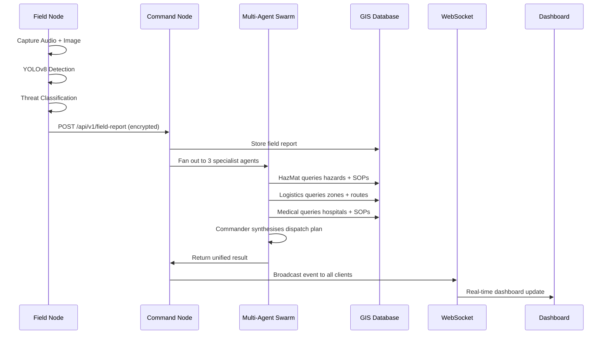

# 🛡️ Aegis — Codebase Architecture

> A complete guide to every file in the Aegis project, how they connect, and what each one does.

---

## System Overview

```
┌──────────────────────────────────────────────────────────────────────┐
│                      FIELD NODE  (Node A)                          │
│  field_node.py                                                      │
│  ├─ Audio capture → Gemma 4 E2B transcription                      │
│  ├─ Webcam capture → YOLOv8-nano / HOG detection                   │
│  ├─ Threat classification                                           │
│  └─ Encrypted mesh transmission (SQLite outbox)                     │
└───────────────────────────┬──────────────────────────────────────────┘
                            │  HTTP POST (simulated mesh)
                            ▼
┌──────────────────────────────────────────────────────────────────────┐
│                    COMMAND NODE  (Node B)                           │
│  command_node.py                                                    │
│  ├─ FastAPI server (:8091)                                          │
│  ├─ Multi-Agent Swarm (HazMat / Logistics / Medical / Commander)   │
│  ├─ Agentic Voice UI (RAG context from GIS + events)               │
│  ├─ Sensor threshold escalation                                     │
│  ├─ MQTT subscriber → WebSocket broadcaster                        │
│  └─ Serves dashboard + citizen portal                               │
└───────┬──────────────┬──────────────┬────────────────────────────────┘
        │              │              │
        ▼              ▼              ▼
   ┌─────────┐   ┌──────────┐   ┌──────────────┐
   │ PostGIS │   │ SQLite   │   │  Mosquitto   │
   │  DB     │   │ Fallback │   │  MQTT Broker │
   └─────────┘   └──────────┘   └──────┬───────┘
                                       ▲
                                       │  MQTT Publish
                              ┌────────┴────────┐
                              │ sensor_network.py│
                              │ (IoT Simulator) │
                              └─────────────────┘
```

---

## Python Files

### Core Application

| File | Lines | Purpose |
|------|-------|---------|
| [command_node.py](file:///c:/Users/harsh/Gemma4/command_node.py) | ~800 | **The brain of Aegis.** FastAPI server that receives field reports, processes them through the Multi-Agent Swarm, serves the Commander Dashboard and Citizen Portal, handles WebSocket broadcasting, MQTT subscription, sensor threshold alerts, and the Agentic Voice UI. Contains the GIS database wrapper (SQLite), LLM backends (real Gemma 4 31B via llama-cpp + mock), and the legacy single-agent `ReasoningEngine`. |
| [field_node.py](file:///c:/Users/harsh/Gemma4/field_node.py) | ~960 | **The edge device.** Simulates a field operator's hardware: captures audio (microphone), captures images (webcam), runs YOLOv8-nano or HOG detection, transcribes audio via Gemma 4 E2B, classifies threats, and transmits encrypted reports to the Command Node. Contains three inference backends: LiteRT, Cactus, and Mock. Includes the SQLite-backed offline mesh outbox with encrypted payloads. |
| [config.py](file:///c:/Users/harsh/Gemma4/config.py) | ~90 | **Single source of truth** for all tunable parameters: model paths, sampling hyperparameters (temp, top_p, top_k), network endpoints, database settings (SQLite + PostGIS), MQTT broker config, and multi-agent orchestration settings. All values can be overridden via environment variables. |

### Phase 1 Modules

| File | Lines | Purpose |
|------|-------|---------|
| [multi_agent.py](file:///c:/Users/harsh/Gemma4/multi_agent.py) | ~280 | **Multi-Agent Swarm Engine.** Drop-in replacement for the old single-agent `ReasoningEngine`. Fans out each field report to three specialist agents (HazMat, Logistics, Medical) — each with restricted tool access — then a Commander agent synthesises their assessments into the final dispatch plan. Contains specialist system prompts, tool-access control maps, and mock assessment generators. |
| [gis_postgis.py](file:///c:/Users/harsh/Gemma4/gis_postgis.py) | ~250 | **PostGIS database backend.** Drop-in replacement for the SQLite `GISDatabase` class. Uses real geospatial queries (`ST_DWithin`, `ST_Distance_Sphere`, GIST indices) instead of Python-side Haversine. Also stores IoT sensor readings with geospatial points. |
| [sensor_network.py](file:///c:/Users/harsh/Gemma4/sensor_network.py) | ~200 | **IoT sensor simulator.** Generates telemetry for 13 sensors across four types: Air Quality (AQI), Seismic (Mw), Flood (water-level in meters), and Fire (thermal °C). Publishes via MQTT to Mosquitto by default, with an `--http` flag for legacy REST API mode. |

### Database Setup

| File | Lines | Purpose |
|------|-------|---------|
| [setup_db.py](file:///c:/Users/harsh/Gemma4/setup_db.py) | ~350 | **SQLite database bootstrap.** Creates the `local_gis.db` file with tables for `safe_zones`, `hazards`, `routes`, `field_reports`, and `sops` (FTS5 full-text search). Seeds it with realistic mock data for the Cascadia Bay earthquake scenario. Run with `--reset` to drop and recreate. |
| [setup_postgis.py](file:///c:/Users/harsh/Gemma4/setup_postgis.py) | ~220 | **PostGIS database bootstrap.** Mirrors `setup_db.py` but creates tables with `GEOMETRY(Point, 4326)` columns, GIST spatial indices, and `tsvector` FTS. Also adds a `sensor_readings` table. Requires a running PostgreSQL+PostGIS instance (via Docker). |

### Testing & Simulation

| File | Lines | Purpose |
|------|-------|---------|
| [simulate_chaos.py](file:///c:/Users/harsh/Gemma4/simulate_chaos.py) | ~70 | **Load tester.** Blasts the Command Node with 30 concurrent field reports using randomised disaster types, GPS jitter, and operator names (via Faker). Useful for stress-testing the dashboard and WebSocket broadcasting. |
| [eval_safety.py](file:///c:/Users/harsh/Gemma4/eval_safety.py) | ~84 | **LLM safety evaluator.** Runs two adversarial scenarios (HazMat routing + Tsunami evacuation) against the Command Node and checks that the dispatch plan includes required safety phrases (e.g. "mask", "hazmat") and excludes forbidden ones (e.g. "safe to proceed without"). |
| [tests/test_api.py](file:///c:/Users/harsh/Gemma4/tests/test_api.py) | ~59 | **FastAPI endpoint tests.** Uses `TestClient` to verify the health check, field report submission, sensor data ingestion, voice commands, the citizen portal, and WebSocket connectivity. |
| [tests/test_gis.py](file:///c:/Users/harsh/Gemma4/tests/test_gis.py) | ~34 | **GIS database unit tests.** Tests the Haversine function, safe zone queries (capacity filtering), hazard queries (severity filtering), and SOP full-text search. |

---

## Frontend Files

| File | Purpose |
|------|---------|
| [templates/index.html](file:///c:/Users/harsh/Gemma4/templates/index.html) | **Commander Dashboard.** Three-panel layout: incoming field reports list (left), Leaflet.js live operations map with heatmaps and drone animations (center), and AI reasoning/dispatch plan viewer + voice interface (right). Includes an animated architecture diagram showing data flow between Node A → Node B → GIS DB. |
| [templates/portal.html](file:///c:/Users/harsh/Gemma4/templates/portal.html) | **Citizen Evacuation Portal.** Public-facing, mobile-responsive page with a full-screen dark Leaflet map, floating sidebar showing evacuation directives, and pulsing hazard markers. Translates complex AI dispatch plans into simple civilian instructions. Self-contained CSS (no external stylesheet). |
| [static/script.js](file:///c:/Users/harsh/Gemma4/static/script.js) | **Dashboard JavaScript.** Handles: Leaflet map initialisation with CartoDB dark tiles, WebSocket connection with auto-reconnect, real-time report rendering, safe zone/hazard layer loading, predictive wind-dispersion heatmaps (`leaflet-heat`), animated drone dispatch, architecture diagram packet animations, IoT sensor marker updates, and Web Speech API push-to-talk voice interface. |
| [static/style.css](file:///c:/Users/harsh/Gemma4/static/style.css) | **Dashboard CSS.** Dark glassmorphism design system with CSS custom properties, responsive grid layout, report card styling with threat-level colour coding, scrollbar theming, markdown rendering styles, and architecture diagram animation keyframes. Uses Inter + Outfit Google Fonts. |

---

## Infrastructure & Config Files

| File | Purpose |
|------|---------|
| [docker-compose.yml](file:///c:/Users/harsh/Gemma4/docker-compose.yml) | Defines three services: `command-center` (the app), `gis-db` (PostGIS 15), and `mqtt-broker` (Eclipse Mosquitto 2). Wires them together with environment variables and a persistent `pgdata` volume. |
| [Dockerfile](file:///c:/Users/harsh/Gemma4/Dockerfile) | Builds the command center image from `python:3.11-slim` with system deps for audio/video/llama-cpp, installs pip requirements, seeds the SQLite DB, and exposes port 8091. |
| [mosquitto.conf](file:///c:/Users/harsh/Gemma4/mosquitto.conf) | Minimal Mosquitto MQTT broker config: listens on port 1883 with anonymous access (dev mode). |
| [requirements.txt](file:///c:/Users/harsh/Gemma4/requirements.txt) | All Python dependencies grouped by purpose: llama-cpp-python, FastAPI/uvicorn/httpx, pydantic, Pillow/numpy/opencv, soundfile/sounddevice, rich, pyttsx3, pytest/Faker, psycopg2-binary, aiomqtt, ultralytics. |
| [pytest.ini](file:///c:/Users/harsh/Gemma4/pytest.ini) | Sets `pythonpath = .` and `asyncio_mode = auto` for pytest-asyncio. |
| [.dockerignore](file:///c:/Users/harsh/Gemma4/.dockerignore) | Excludes `venv/`, `__pycache__/`, `models/`, `.git/`, `.gemini/` from Docker builds. |

---

## Data Directories

| Directory | Contents |
|-----------|----------|
| `data/` | `local_gis.db` — the SQLite GIS database. Also stores `mesh_queue.db` (encrypted offline outbox) at runtime. |
| `models/` | Placeholder for model weights: `gemma-4-E2B-it.litertlm` (field node) and `gemma-4-31B-it-Q4_K_M.gguf` (command node). Also downloads `yolov8n.pt` on first YOLOv8 run. |
| `mock_inputs/` | Placeholder for sample audio (`.wav`) and image (`.jpg`) files used in mock/demo mode. |
| `logs/` | Runtime log output directory. |
| `templates/` | Jinja2 HTML templates served by FastAPI. |
| `static/` | CSS and JavaScript served as static files. |
| `tests/` | Pytest test suite. |

---

## Data Flow Summary


